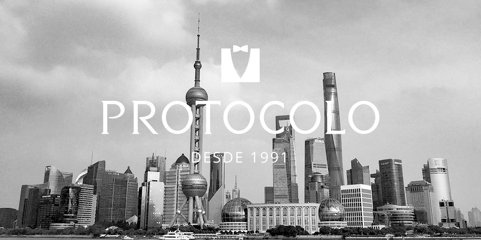

# PROTOCOLO Promotion Website Prototype

## PROTOCOLO

PROTOCOLO is the reference company in the male market for party and ceremony. With a high level of specialization, our extensive experience based on more than one hundred years of history in the textile sector is linked to a great capacity for innovation and leadership vocation.

<a href="https://www.protocolonovios.com/">Find out more about PROTOCOLO</a>

## China International Import Expo 2018

China International Import Expo is a 6-day event being held from 5th November to 10th November 2018 at the National Convention & Exhibition Center in Shanghai, China. This event gathers government officials, business communities, exhibitors and professional purchasers across the world and provides them new channels for countries and regions to do business, strengthen cooperation and promote common prosperity of the world economy and trade.

<a href="https://www.ciie.org/zbh/en/">Find out more about China International Import Expo 2018</a>

## Promotion Website Prototype

This website is intended to celebrate and promote the presence of PROTOCOLO in one of the most important Asian markets at the present time. Inside this prototype, users will get important information related to the location inside the exhibition and a brief presentation of the Chinese most international city, Shanghai.

---

  <a href="#components">Components</a>
  &mdash;
  <a href="#find-me">Notes</a>
  &mdash;
  <a href="#find-me">Find Me</a>

Notes
-----

The presentation of this website and code can be used as a starting point by students or self-learning enthusiasts. Keep in mind the brand, texts and video are part of PROTOCOLO.

Components
----------

* [A-Frame](https://aframe.io/)
* [Gulp](https://gulpjs.com/)
* [Milligram](https://milligram.io/)
* [Plyr](https://plyr.io/)
* [Sal](https://mciastek.github.io/sal/)

Find Me
-------

Find me in [MeSopa](https://mesopa.com/) and check my other works.
Thanks!